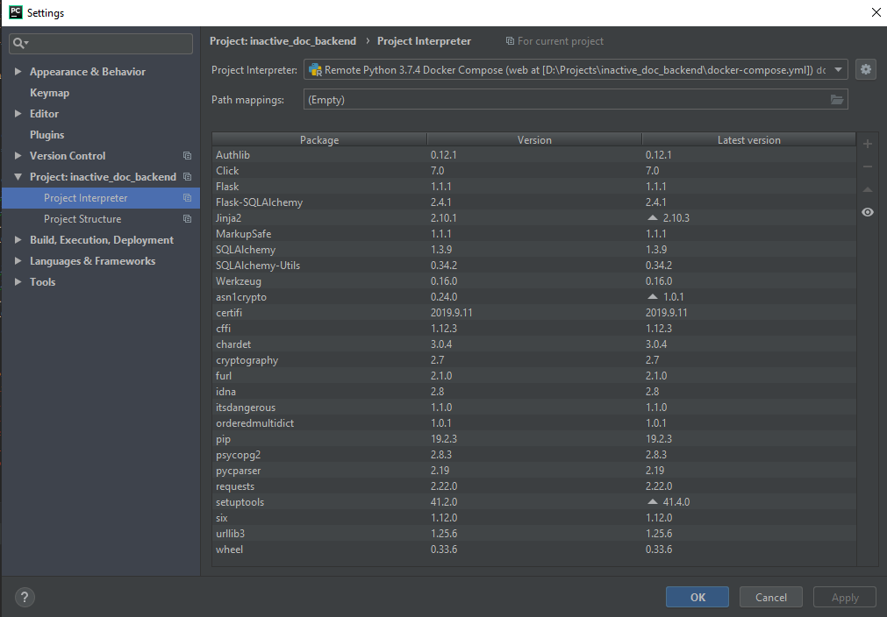
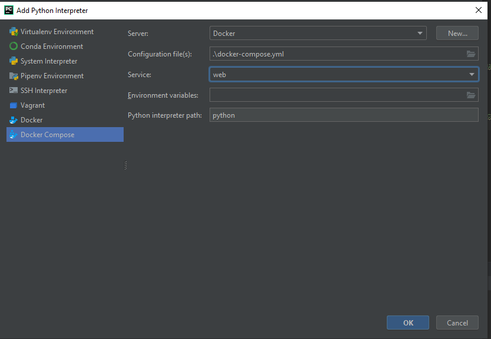
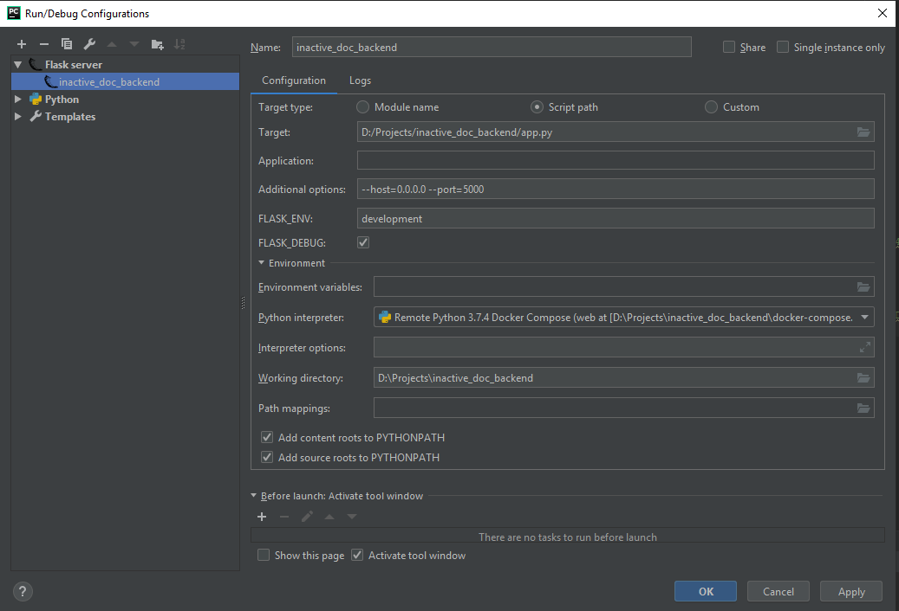

Configure flask project (for Pycharm)
=

add an interpreter in pycharm:  
  
  

after interpreter you could configure flask project  

  

now you able to start flask in debug mode

---
If you use Docker
-
just start `docker-compose up`

---
Tests (with Docker)
-
after you have started the project please use following command:`

`docker-compose run --rm --entrypoint "python3 tests.py BasicTests" server`

Configure without Docker
=
use  `virtualenv venv`

than `source venv/bin/activate`

and `pip install -r requirements.txt`

`python app.py --host=0.0.0.0 --port=5000`

and with http://127.0.0.1:5000

Tests
-
python tests.py